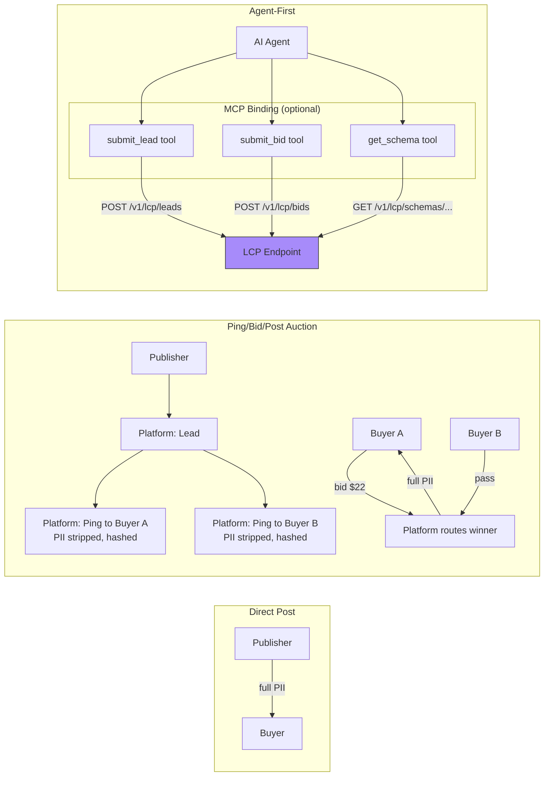

# LCP — Lead Context Protocol

> **Created by Spear Systems** (a Spear company). Open standard — Apache 2.0, free to implement.

**The "HTTP of lead generation"** — a universal protocol for transferring consumer lead data (PII) between publishers, platforms, and buyers. Every channel (form fills, calls, AI agents) and the full lifecycle (intake → auction → delivery → conversion) in one format.

Works in three ways:

1. **Direct post** — publisher sends a lead directly to one buyer
2. **Ping/bid/post auction** — platform runs real-time bidding across multiple buyers
3. **Agent-first** — AI agents submit, transport, and receive leads via the MCP binding

## How it works



## I'm a...

### Publisher (collecting leads)
```bash
# 1. Install the MCP server (gives you submit_lead, get_schema, etc.)
pip install -e implementations/mcp-server/

# 2. Configure (one-time — set per-partner secrets)
export LCP_ENDPOINT=https://your-platform.com
export LCP_SENDER_ID=your-publisher-id
export LCP_HMAC_SECRET=your-...-secret

# 3. Submit a lead
lcp-mcp-server  # then use tools: submit_lead, get_schema, list_offers
```
See [PLATFORM-INTEGRATION.md](docs/PLATFORM-INTEGRATION.md) for form/CRM mappings (Facebook, Google, Twilio, Typeform, HubSpot, Salesforce, TikTok).

**No MCP?** Just POST directly to `POST /v1/lcp/leads` with an HMAC-signed JSON body. The [MCP server](implementations/mcp-server/) is a thin adapter — you can write your own in any language.

### Buyer (receiving leads)

Implement one webhook endpoint. Depending on the routing model:

| Model | Your endpoint receives | Your response |
|-------|----------------------|---------------|
| **Direct post** | `post` (full PII) | HTTP 200 (ack) |
| **Auction** | `ping` (no PII, hashed) | `bid` (accept/reject + price) |
| **Auction** | `post` (full PII — only if you won) | HTTP 200 (ack) |

**Concrete example** — respond to a ping and accept a post:

```python
from flask import Flask, request, jsonify
import hmac, hashlib

app = Flask(__name__)
HMAC_SECRET = "your-shared-secret-with-publisher"

@app.route("/lcp/webhook", methods=["POST"])
def receive_lcp():
    # Verify HMAC signature (prevents forged pings/posts)
    signature = request.headers.get("X-LCP-Signature")
    body = request.data
    expected = hmac.new(HMAC_SECRET.encode(), body, hashlib.sha256).hexdigest()
    if not hmac.compare_digest(signature, expected):
        return "Unauthorized", 401

    envelope = request.json
    msg_type = envelope["lcp"]["message"]["type"]

    if msg_type == "ping":
        # Ping = no PII, just hashed attributes + floor price
        return jsonify({
            "lcp": {
                "version": "1.0.0",
                "message": {"type": "bid", "id": envelope["lcp"]["message"]["id"]},
                "payload": {
                    "ping_id": envelope["lcp"]["payload"]["ping_id"],
                    "decision": "accept",
                    "bid_price_cents": 2200,
                    "currency": "USD"
                }
            }
        }), 200

    elif msg_type == "post":
        # Post = full PII — only delivered here if you won the auction
        consumer = envelope["lcp"]["payload"]["consumer"]
        print(f"New lead: {consumer.get('first_name')} — {consumer.get('phone')}")
        return jsonify({"status": "received"}), 200
```

**No server?** Use the MCP server as your buyer adapter — it translates between HTTP callbacks and MCP tool calls. Or use `submit_bid` in ChatGPT/Claude with the MCP server configured as a plugin.

### Platform operator
Deploy the reference MCP server, configure buyers/publishers with their HMAC secrets, and you're routing leads. See `schemas/bid.json` for the bid response format and `schemas/` for message types.

## Quickstart

```bash
# Run the conformance tests (validates all 5 vertical schemas + 9 message schemas)
python3 test-vectors/conformance.py --verbose   # 27/27 pass

# Run the MCP server locally
lcp-mcp-server                                   # stdio transport for Claude/agents

# Get a schema — see exact fields for any vertical
get_schema("verticals/mortgage")                 # all fields + ping_safe tags
```

## Repository

```
schemas/         ── Envelope + core + message types (lead, call, ping, post, ack, event, bid)
verticals/       ── Per-vertical JSON Schemas (mortgage, insurance, solar, legal, home_services)
examples/        ── Sample payloads showing each message type
test-vectors/    ── 27 conformance tests (L1/L2/L3)
implementations/ ── Reference MCP server (drop-in adapter for any LCP endpoint)
docs/            ── Integration guides, design notes, deep-research review
governance/      ── CONTRIBUTING, SECURITY, EXTENSION-REGISTRY, TRADEMARK, CLA
SPEC.md          ── Full specification (14 sections + appendices)
```

## License

Apache 2.0. Free to implement — no membership, no approval, no fees.
See [governance/](governance/) for anti-capture and trademark policies.
