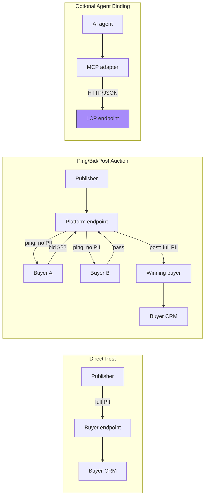

# LCP — Lead Context Protocol

> **Created by Spear Systems** (a Spear company). Open standard — Apache 2.0, free to implement.

**The "HTTP of lead generation"** — a universal protocol for transferring consumer lead data (PII) between publishers, advertisers/buyers, platforms, and downstream systems. LCP covers form fills, calls, chats, APIs, and AI agents, together with the lifecycle from intake through delivery, conversion, disputes, and consent changes.

> **Important:** LCP is an open wire protocol, not a hosted lead marketplace or exchange. This repository contains the specification, schemas, examples, conformance tests, OpenAPI definition, and an optional MCP adapter. A production deployment still needs an HTTP endpoint, authentication, storage, routing, offer configuration, buyer delivery, and CRM integrations.

**Status:** Draft v1.0, under active development. The conformance runner currently passes 27/27 test vectors. The reference MCP package is version 0.1.0 and is an adapter, not a complete LCP platform.

## Who uses LCP?

| Role | What they use LCP for |
|---|---|
| **Publisher / lead source** | Send leads from forms, ads, calls, marketplaces, or other acquisition channels. |
| **Advertiser / buyer** | Receive direct posts or bid on privacy-preserving pings, then receive winning posts. |
| **Platform / exchange** | Accept publisher submissions, publish buyer offers, filter and route leads, run auctions, and deliver lifecycle events. |
| **Integrator / CRM vendor** | Translate LCP messages into CRM, dialer, marketing, or analytics systems. |
| **AI agent** | Submit or process leads through the optional MCP binding. |

## Choose an integration model

LCP works in three ways:

1. **Direct post** — a publisher sends a lead directly to one buyer.
2. **Ping/bid/post auction** — a platform sends non-PII pings to eligible buyers, collects bids, selects a winner, and sends full PII only to the winning buyer.
3. **Agent binding** — AI agents submit, transport, or process LCP messages through the optional MCP adapter.

## How it works



## Publisher: sending leads

### HTTP/JSON integration — no package required

LCP is JSON over HTTP. A publisher can implement it in any language using the schemas and [OpenAPI definition](api/lcp-openapi.yaml). No LCP-specific package is required for a normal HTTP integration.

```bash
# Point this at the LCP-compatible platform or buyer endpoint you use.
curl -X POST https://your-platform.example/v1/lcp/leads \
  -H 'Content-Type: application/json' \
  -H 'X-LCP-Timestamp: 2026-08-15T10:20:00Z' \
  -H 'X-LCP-Idempotency-Key: pub-lead-20260815-001' \
  -H 'X-LCP-Signature: <signature>' \
  --data-binary @examples/lead.json
```

Use a per-partner authentication secret. See [SPEC.md §9](SPEC.md#9-security) for TLS, API-key, HMAC, replay protection, and per-pair hash requirements.

See [the platform integration guide](docs/PLATFORM-INTEGRATION.md) for mappings from Facebook Lead Ads, Google Lead Forms, Twilio, Typeform, HubSpot, Salesforce, and TikTok.

### Optional MCP adapter for AI agents

The MCP adapter is useful when a publisher or AI agent needs to interact with an LCP-compatible REST endpoint through an MCP client. It is not required for HTTP integrations and does not deploy an LCP endpoint.

From a checkout of this repository:

```bash
python3 -m venv .venv
source .venv/bin/activate                 # Windows: .venv\\Scripts\\activate
python -m pip install -e ./implementations/mcp-server
```

The local editable install creates the `lcp-mcp-server` command. The package is currently distributed from this repository rather than assumed to be available on PyPI.

Configure the adapter with the endpoint and one partner credential:

```bash
export LCP_ENDPOINT=https://your-platform.example
export LCP_SENDER_ID=your-publisher-id
export LCP_API_KEY=your-api-key            # or use LCP_HMAC_SECRET
```

Then configure your MCP client to launch `lcp-mcp-server`. For example, an MCP client configuration can contain:

```json
{
  "mcpServers": {
    "lcp": {
      "command": "lcp-mcp-server",
      "env": {
        "LCP_ENDPOINT": "https://your-platform.example",
        "LCP_API_KEY": "your-api-key",
        "LCP_SENDER_ID": "your-publisher-id"
      }
    }
  }
}
```

Available tools include `submit_lead`, `submit_call`, `get_schema`, `get_capabilities`, `list_offers`, `query_lead_status`, and `submit_bid`. See the [MCP adapter README](implementations/mcp-server/README.md) for its complete configuration.

## Advertiser / buyer: receiving leads

A buyer can either operate its own receiving endpoint or receive delivery from a platform. The buyer-side flow is:

| Model | Buyer receives | Buyer returns or sends |
|---|---|---|
| **Direct post** | `post` containing full PII | Acknowledgement and, if needed, lifecycle events |
| **Auction** | `ping` containing no PII and only permitted hashes/attributes | `bid` with accept/reject/pass and price |
| **Auction winner** | `post` containing full PII | Acknowledgement, conversion events, disputes, or consent updates |

In an auction, the buyer and platform should use a dedicated credential pair. A publisher's credential must not be reused as the buyer's credential.

### Valid bid envelope shape

A bid is an LCP message, not just an arbitrary JSON response. It must include the normal envelope fields:

```json
{
  "lcp": {
    "version": "1.0.0",
    "message": {
      "id": "990e8400-e29b-41d4-a716-446655440009",
      "type": "bid",
      "timestamp": "2026-08-15T10:20:08Z",
      "sender_id": "buyer_001",
      "receiver_id": "platform_001",
      "correlation_id": "770e8400-e29b-41d4-a716-446655440002",
      "idempotency_key": "buyer-001-bid-ping_001-001",
      "test": false
    },
    "payload": {
      "ping_id": "ping_001",
      "decision": "accept",
      "bid_price_cents": 2200,
      "currency": "USD",
      "estimated_contact_seconds": 45,
      "buyer_reference": "buyer-internal-bid-001"
    }
  }
}
```

The platform's bid endpoint is documented as `POST /v1/lcp/bids` in the [OpenAPI definition](api/lcp-openapi.yaml). The exact webhook delivery and response arrangement can be deployment-specific, but all messages should remain valid LCP envelopes.

### Signature verification

For HMAC-authenticated HTTP messages, the binding requires a signature and timestamp; HTTP messages should also carry an idempotency key. The receiver must reject missing or invalid credentials and stale timestamps before processing PII. Every deployment must document one canonical signing input; the reference adapter currently signs the request body together with the timestamp.

Illustrative verification logic:

```python
import hashlib
import hmac

signature = request.headers.get("X-LCP-Signature")
timestamp = request.headers.get("X-LCP-Timestamp")
idempotency_key = request.headers.get("X-LCP-Idempotency-Key")
body = request.data

if not timestamp or not idempotency_key:
    return "Unauthorized", 401

# Require signature too when this partner uses HMAC authentication.
if not signature:
    return "Unauthorized", 401

# Use the same canonical signing profile as the sending partner.
expected = hmac.new(
    HMAC_SECRET.encode(), body + timestamp.encode(), hashlib.sha256
).hexdigest()

if not hmac.compare_digest(signature, expected):
    return "Unauthorized", 401

# Also enforce timestamp freshness and idempotency before processing body.
```

Keep secrets outside source control. The sample above is intentionally a verification outline; production receivers should also validate the full envelope and message schema before handing a post to a CRM.

## Buyer offers and acceptance criteria

A buyer does not need to accept every lead available on a platform. A platform can publish one or more **offers** for a buyer, each describing the lead characteristics, capacity, delivery windows, and commercial terms that apply.

The current protocol already supports these standardized offer restrictions:

| Criteria | Examples |
|---|---|
| Source | Exclude scraped, outbound, or marketplace leads |
| Acquisition | Exclude cold outbound or other acquisition methods |
| Incentives | Reject incentivized leads or selected incentive types |
| Verification | Require a verified phone or email |
| Quality | Set a maximum spam-risk score or minimum data completeness |
| Compliance | Require consent evidence; reject DNC, litigator, or blacklist flags |
| Delivery | Limit delivery to specific hours, days, verticals, or channels |
| Capacity | Set daily/hourly caps and remaining capacity |
| Pricing | Publish a floor price, currency, and payable definition |

A typical platform flow is:

1. The buyer defines an offer in the platform's dashboard or admin system.
2. The platform evaluates incoming leads against that offer.
3. Leads that fail the offer are not pinged to that buyer.
4. Eligible leads are sent as PII-free `ping` messages.
5. The buyer accepts, rejects, or passes with a `bid`.
6. The platform routes a full-PII `post` only when the buyer wins.

`GET /v1/lcp/offers` lets an authenticated party discover active offers. Offer creation and management are currently deployment-specific; the protocol does not require a universal buyer-admin API. See [SPEC.md §8](SPEC.md#8-capability-discovery) and the `offers` section of [api/lcp-openapi.yaml](api/lcp-openapi.yaml).

## Running your own LCP deployment

“Running your own LCP” can mean two different things:

### Buyer-operated endpoint

A buyer can operate an LCP-compatible receiver and allow publishers to send direct posts:

```text
Publisher → Buyer LCP endpoint → Buyer CRM or dialer
```

The buyer is responsible for authentication, validation, deduplication, compliance checks, acceptance/rejection, and downstream delivery.

### Buyer-operated platform or exchange

A buyer, network, or technology provider can operate a platform that accepts publisher submissions and routes them to one or more configured buyer offers:

```text
Publisher → LCP platform
                 ├─ validate and deduplicate
                 ├─ match buyer offers
                 ├─ send ping messages
                 ├─ collect bids
                 ├─ select a winner
                 └─ deliver the post and lifecycle events
```

This repository does not currently include that HTTP gateway, routing engine, database, offer-management UI, or buyer webhook service. Implementers can use the [OpenAPI definition](api/lcp-openapi.yaml), [schemas](schemas/), and [examples](examples/) as the contract for building one.

## Platform operator

A platform operator typically needs to provide:

- `POST /v1/lcp/leads` and `POST /v1/lcp/calls` intake endpoints
- Authentication, HMAC verification, timestamp freshness, and idempotency
- Schema and ping-safe validation
- Lead storage, deduplication, and lifecycle state management
- Offer configuration and matching
- Ping/bid/post routing, including expiry and capacity handling
- Buyer delivery endpoints and signed lifecycle events
- Capability, schema, and offer discovery
- CRM, dialer, and conversion-event integrations

The reference MCP server is not the platform itself; it is a stateless adapter that calls an existing LCP-compatible REST API. Start with the [HTTP API contract](api/lcp-openapi.yaml), then add the deployment services your business requires.

## Quickstart

### Run the conformance vectors

```bash
# Install the conformance runner's dependencies if needed.
python3 -m pip install jsonschema referencing

# Run 27 L1/L2/L3 vectors.
python3 test-vectors/conformance.py --verbose
```

The vectors cover envelope validation, lifecycle messages, ping/post PII separation, ping-safe vertical attributes, bidding, compliance evidence, agent attestation, status transitions, exclusivity, and expiry. They are conformance fixtures, not a hosted endpoint or a complete integration test.

### Inspect a schema

Schemas are available directly in [`schemas/`](schemas/) and [`verticals/`](verticals/). The optional MCP adapter exposes the same discovery through its `get_schema` tool, and an LCP endpoint may expose them through `GET /v1/lcp/schemas/{name}`.

## Repository

```
schemas/         ── Envelope, core, and message JSON Schemas
verticals/       ── Per-vertical schemas (mortgage, insurance, solar, legal, home_services)
examples/        ── Sample payloads for lead, call, ping, post, bid, ack, and event
test-vectors/    ── 27 conformance vectors across L1/L2/L3
implementations/ ── Reference MCP adapter for an existing LCP endpoint
docs/            ── Integration guides and design notes
api/             ── OpenAPI 3.1 HTTP transport definition
governance/      ── Contributing, security, extension, trademark, and CLA policies
SPEC.md          ── Canonical protocol specification
```

## Further reading

- [Canonical specification](SPEC.md)
- [HTTP API definition](api/lcp-openapi.yaml)
- [Platform integration guide](docs/PLATFORM-INTEGRATION.md)
- [JSON Schemas](schemas/)
- [Examples](examples/)
- [Conformance vectors](test-vectors/)
- [Reference MCP adapter](implementations/mcp-server/)
- [Security policy](governance/SECURITY.md)
- [Trademark and conformance claims](governance/TRADEMARK.md)

## License

Apache 2.0. Free to implement — no membership, no approval, no fees.
See [governance/](governance/) for anti-capture and trademark policies.
